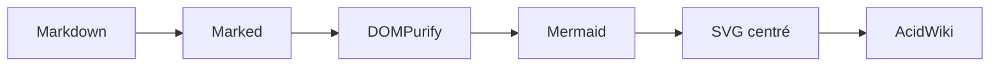
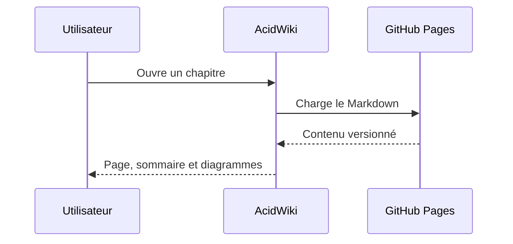

# AcidWiki — page de test visuel

Cette page vérifie en une seule fois le thème **Deep Math Academy**, le fond animé, la typographie, la table des matières, les formules et les diagrammes Mermaid transparents et centrés.

> Le cadre de chaque diagramme doit être entièrement transparent : aucune bordure, aucun fond et aucune ombre.

## Diagramme de flux



## Diagramme de séquence



## Mathématiques

Une formule en ligne : $E = mc^2$.

Une formule centrée :

$$
\nabla_\theta \mathcal{L}(\theta)
= \frac{1}{n}\sum_{i=1}^{n}
\nabla_\theta \ell\bigl(f_\theta(x_i), y_i\bigr)
$$

## Tableau

| Élément | Résultat attendu |
|---|---|
| Fond | Animation de particules visible avec le thème Deep Math Academy |
| Mermaid | Diagramme centré, sans cadre |
| Dossiers | Icônes de taille uniforme, même avec un long libellé |
| Sommaire | Défilement indépendant et suivi de la section active |
| Fil d’Ariane | Retour vers `Index` ou `README` en priorité |

## Code

```javascript
const wiki = {
  theme: 'deep-math-academy',
  diagrams: 'centered',
  navigation: 'index-first'
};
```

## Test du sommaire

Les sections suivantes allongent volontairement la table des matières.

### 01 — Découverte

Le contenu local doit être découvert avant l’API GitHub pendant un aperçu sur `localhost`.

### 02 — Navigation

Les liens internes doivent être traités sans rechargement complet de la page.

### 03 — Hiérarchie

Les niveaux imbriqués de la navigation doivent rester lisibles.

### 04 — Icônes

Une icône de dossier garde une largeur et une hauteur fixes lorsque son nom passe sur plusieurs lignes.

### 05 — Lisibilité

La zone de lecture conserve une largeur confortable sur les grands écrans.

### 06 — Métadonnées

Le temps de lecture et la date restent visibles au-dessus du sommaire.

### 07 — Progression

La barre de progression suit le défilement de la page.

### 08 — Cache

La version du contenu fait partie de la clé de cache.

### 09 — Sécurité

Le HTML issu du Markdown reste nettoyé avant son insertion.

### 10 — Responsive

Le menu et le sommaire restent accessibles sur mobile.

### 11 — Accessibilité

Le canevas décoratif est ignoré par les technologies d’assistance.

### 12 — Mouvement réduit

L’animation respecte la préférence système `prefers-reduced-motion`.

### 13 — Favicon

Le logo du dépôt est utilisé immédiatement comme favicon.

### 14 — Validation finale

Si cette section est accessible depuis le sommaire, la zone de TOC défile correctement.
