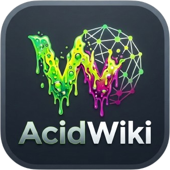

<p align="center">
  
</p>

# AcidWiki

[](LICENSE)  [](https://github.com/infinition/AcidWiki/releases) [](https://buymeacoffee.com/infinition)

A self-updating wiki engine for GitHub repositories. Deploy once, forget it. Content goes into Markdown files, the engine handles navigation, versioning, and daily updates automatically.


The core logic lives in this repository. Client repositories reference AcidWiki via a reusable GitHub Actions workflow and get updates pulled in every day at 4 AM without any manual intervention.

---

## Features

- One engine for every use: GitHub repository, local server, Obsidian vault, or
  offline static file. The mode is declared in a JSON file.
- Configured through `acidwiki.json` only, no JavaScript to write.
- Automatic content discovery: add a Markdown file and it shows up.
- Optional static index: no API calls, works offline, no GitHub rate limit.
- Obsidian vault syntax rendered everywhere: `[[links]]`, `![[images]]`,
  embedded video, audio and PDF, callouts, YAML front matter.
- Quizzes and flashcards, inline in the page or in a JSON file next to it,
  with nothing to enable.
- Automatic detection of GitHub Releases or Tags for the version display.
- Daily CRON update: the engine keeps itself up to date.
- 22 themes with hover preview, dark mode, responsive layout.
- Native Mermaid diagrams, KaTeX formulas, full text search.
- Sticky table of contents that follows your reading, progress bar, sorting by
  name or by modification date.

See [docs/CONFIGURATION.md](docs/CONFIGURATION.md) for the settings and
[docs/CONTENT.md](docs/CONTENT.md) for the writing syntax.

## Quick Start

### Method A: Template (new project)

1. Click "Use this template" to create a new repository.
2. Go to Settings > Actions > General. Under "Workflow permissions", select "Read and write permissions".
3. Push any change. The workflow creates `wiki/docs/` and a default `acidwiki.json`.
4. Go to Settings > Pages, set source to "Deploy from a branch" > main > /(root).

### Method B: Existing project

Create `.github/workflows/wiki-sync.yml` in your repository:

```yaml
name: Wiki Sync

on:
  push:
    branches: [ main ]
    paths:
      - 'wiki/**'
      - 'acidwiki.json'
  schedule:
    - cron: '0 4 * * *'
  workflow_dispatch:

jobs:
  sync:
    uses: infinition/AcidWiki/.github/workflows/wiki-engine.yml@main
    secrets: inherit
```

---

## Configuration (`acidwiki.json`)

```json
{
  "social": {
    "discord": "https://discord.gg/yourserver",
    "reddit": "https://reddit.com/r/yoursubreddit"
  },
  "buymeacoffee": "https://buymeacoffee.com/yourname",
  "debug": false
}
```

- `social.discord` / `social.reddit`: set to `null` to hide the buttons.
- `buymeacoffee`: your donation link.
- `debug`: verbose browser console logging.

Project name, version, GitHub URL, and footer copyright are detected automatically from repository context.

---

## Logo

Priority order for logo and favicon:

1. `wiki/assets/logo.png` if it exists.
2. A logo found in the repository asset folders: `assets/`, `.github/assets/`,
   `docs/assets/`. A file is only picked when its name says so: `logo.*`,
   `icon.*`, `app_icon.*`, `favicon.*`, a suffixed variant such as
   `icon-256.png`, or the repository name itself (`myrepo.png`). Screenshots are
   left alone. PNG wins over SVG, then WEBP, JPG, GIF, and finally ICO.
3. First image found in `README.md`.
4. Default AcidWiki logo.

Use a square transparent PNG for best results.

---

## Folder structure

```
.
  .github/workflows/
    wiki-sync.yml         Trigger (calls AcidWiki logic)
  acidwiki.json           Your configuration
  wiki/
    docs/                 Put your Markdown files here
      01_Intro/           Folders become categories
        Setup.md
      Guide.md
    assets/               Images (logo.png, screenshots)
    config.js             Generated, do not edit manually
    themes.js             Theme catalog, generated from themes/
    themes/               One stylesheet per theme
    index.json            Static index, built at deployment
  tools/                  Build, check and serve scripts
  index.html              The engine (auto-updated from source)
  README.md               Becomes the home page
```

---

## Writing content

- Create `.md` files inside `wiki/docs/`.
- Folders become menu categories, files become pages.
- Prefix names with numbers to control order: `01_General`, `02_Advanced`.
- Link images: ``.
- Add Mermaid diagrams with a fenced `mermaid` code block.

---

## How updates work

- On push: site rebuilds immediately with your config.
- On schedule: checks for engine changes in `infinition/AcidWiki`, pulls the new `index.html`, regenerates config, commits and pushes automatically.

---

## Local development

On Windows, double click `acidwiki.bat` to browse this repository with its own
engine, or `check.bat` to run every check first and then start the server.

Otherwise, pick whichever fits:

```bash
python tools/serve.py --self        # serve this repository, from any directory
python tools/serve.py --vault .     # serve an Obsidian vault, index built on the fly
node tools/build-index.mjs          # build a static index, then open index.html offline
python -m http.server 8000          # plain preview through directory listings
```

Mode `auto` decides on its own: the static index when it exists, otherwise
detection from the context. Markdown files are discovered automatically.

`AcidWiki-Feature-Test.md` is a ready-made visual test page for Mermaid, KaTeX, tables, code, the animated theme, and long tables of contents.

---

## Star History

<a href="https://www.star-history.com/?repos=infinition%2FAcidWiki&type=date&legend=top-left">
 <picture>
   <source media="(prefers-color-scheme: dark)" srcset="https://api.star-history.com/chart?repos=infinition/AcidWiki&type=date&theme=dark&legend=top-left" />
   <source media="(prefers-color-scheme: light)" srcset="https://api.star-history.com/chart?repos=infinition/AcidWiki&type=date&legend=top-left" />
   
 </picture>
</a>

---

## Tooling

```bash
check.bat                       # every check below, then start the server (Windows)
node tools/build-index.mjs      # build the static index
node tools/build-themes.mjs     # regenerate the theme catalog from wiki/themes/
node tools/check-syntax.mjs     # parse every engine file
node tools/test-modules.mjs     # module test bench
node tools/sync-engine.mjs --check              # verify the engine on its own
node tools/sync-engine.mjs --target <folder>    # update a local deployment
python tools/serve.py --self    # serve this repository
```

`sync-engine.mjs` derives what belongs to the engine from `index.html` itself,
so a newly added resource is carried over without editing any list. A local
deployment keeps its own `wiki/config.js`, `wiki/assets` and index files.

---

## License

MIT. See [LICENSE](LICENSE).
